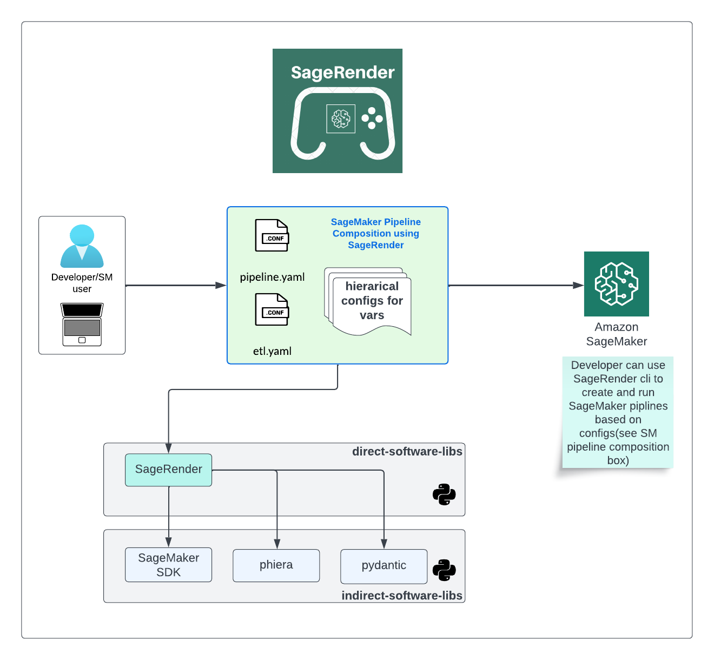

# SageRender
---
[](https://codecov.io/gh/Nike-Inc/sagerender)
[](https://github.com/Nike-Inc/sagerender/actions/workflows/python-test.yaml?branch=main)
[](https://github.com/Nike-Inc/sagerender/actions/workflows/python-build.yaml?branch=main) 
[](https://github.com/Nike-Inc/sagerender/actions/workflows/docker-build.yaml)




A library for configuring SageMaker pipelines using hierarchical configuration pattern. The purpose of this library is to isolate depdency on AWS SageMaker SDK and allow teams to create pipelines using configurations. The hierarchical configuration gives teams flexibility to use a lookups in configuration files to traverse through the hierarchy of configurations.

## Table of Contents
* [Installation](#installation)
* [Changelog](#changelog)
* [Documentation](#documentation)
* [Unit Tests](#unit-tests)
* [Future Work](#future-work)

### Installation
From pypi:
```shell
pip install sagerender
```

From GitHub:
```shell
pip install git+https://github.com/nike-inc/sagerender#egg=sagerender
```

### Changelog
See the [changelog](CHANGELOG.md) for a history of notable changes to SageRender.

### Documentation
#### Commands
```shell
The most commonly used SageRender commands are:
run-pipeline		Run SageMaker Pipeline
upsert-pipeline		Configure and Upsert SageMaker Pipeline
version             Version of SageRender
```

##### Run Pipeline
Use this command to run an AWS SageMaker Pipeline
```shell
sagerender run-pipeline [-h] --pipeline-name PIPELINE_NAME
                               [--region-name REGION_NAME] [--verbose]

optional arguments:
  -h, --help            show this help message and exit
  --pipeline-name PIPELINE_NAME
                        Name of the SageMaker pipeline
  --region-name REGION_NAME
                        Name of the AWS Region
  --verbose, -v         Enable verbose logging
```

##### Upsert Pipeline
Use this command to create/update pipeline definition on AWS SageMaker.
```shell
usage: sagerender upsert-pipeline [-h] --pipeline-name PIPELINE_NAME [--max-parallel-execution-steps MAX_PARALLEL_EXECUTION_STEPS]
                                  [--default-bucket-prefix DEFAULT_BUCKET_PREFIX] [--dry-run] [--local] [--verbose]

options:
  -h, --help            show this help message and exit
  --pipeline-name PIPELINE_NAME
                        Name of the SageMaker pipeline
  --max-parallel-execution-steps MAX_PARALLEL_EXECUTION_STEPS
                        Set the max parallel execution steps for SageMaker pipeline
  --default-bucket-prefix DEFAULT_BUCKET_PREFIX
                        Default bucket prefix sets s3 path to be bucket-prefix/default-bucket-prefix/pipeline-name
  --dry-run             Skip upserting SageMaker pipeline definition. Used for debugging.
  --local, -l           Run in local pipeline mode
  --verbose, -v         Enable verbose logging
```

#### Getting Started
A notebook to help you get started with `SageRender` is available [here](notebook/getting-started.ipynb).

#### Examples
- A simple SageMaker Pipeline configuration with different environments can be found under
[examples/simple](examples/simple).
- A complex SageMaker Pipeline configuration that defines different algorithms across different environments
can be found under [examples/complex](examples/complex).

### Contribution
You can help by contributing to the project!
Contribution guidelines can be found [here](CONTRIBUTING.md).
Instructions to easily set up your local development environment 
can be found [here](DEVELOPMENT.md).

### Unit Tests
#### Prerequisites
* poetry (curl -sSL https://raw.githubusercontent.com/python-poetry/poetry/master/get-poetry.py | python)
#### Setup
Install the package using poetry
```shell
poetry install
```
#### Run Tests
```shell
poetry run pytest
```
#### Run pre-commit checks
```shell
poetry run pre-commit run --all-files
```
### Future Work
* Add support for generating pipeline YAML templates
* Add support for converting YAML to python code and vice versa.
