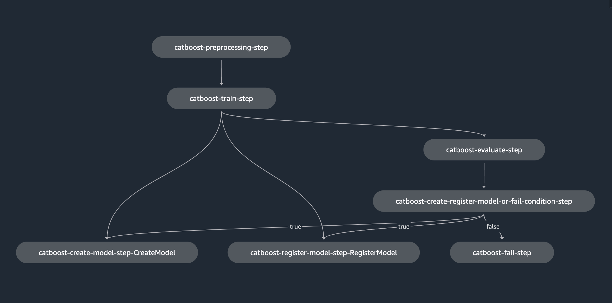

## SageRender Configuration for 3 different Algorithms and Environments

The `hiera.yaml` file is a configuration file for [Phiera](https://github.com/nike-inc/phiera), a key-value lookup tool
for configuration data. It is used to separate data from underlying code. In this project, it is used to manage the
SageMaker Pipeline configuration data of different environments and algorithms.

_Disclaimer_: The SageMaker pipeline configurations in this example are not meant to run, but they are to provide an
example along with representation on how these pipelines can be configured.

Here is a brief explanation of the `hiera.yaml` file:

```yaml
---
backends:
  - yaml

context:
  - env
  - algorithm

# The order of precedence is from least to most
hierarchy:
  - common
  - "environment/%{env}"
  - "algorithm/%{algorithm}"

yaml:
  datadir: examples/complex
```

- `backends`: This specifies the backend data sources Phiera should use. In this case, it's using YAML files.
- `context`: This specifies the context variables that Phiera uses to determine which data to fetch. In this case, it's
  using `env` and `algorithm`. Note: Optional context variables can be defined in the yaml using the format
  `%{var_name}` and then passed in from the cli as `--var-name value` or `--var_name value` to populate the value in
  the yaml. In this example, `%{team}` is an optional context variable.
- `hierarchy`: This specifies the hierarchy of data sources. Phiera will look for data in these sources in the order
  they are listed. In this case, it first looks in the `common` data source, then in the `environment/%{env}` data
  source (where `%{env}` is replaced with the value of the `env` context variable), and finally in the
  `algorithm/%{algorithm}` data source (where `%{algorithm}` is replaced with the value of the `algorithm` context
  variable). In this example in the hierarchy, the `algorithm` section has the highest precedence followed by
  `environment` and `common`.
- `yaml`: This specifies the configuration for the YAML backend. In this case, it's specifying that the data directory
  (where the YAML files are located) is `examples/complex`.

The hierarchy allows for specific configurations for different environments and algorithms. For example, if `env` is
set to `dev` and `algorithm` is set to `xgboost`, Hiera will first look for data in the `common` data source, then in
the `environment/dev` data source, and finally in the `algorithm/xgboost` data source. This allows for common
configurations to be specified in the `common` data source, environment-specific configurations to be specified in the
`environment/%{env}` data sources, and algorithm-specific configurations to be specified in the
`algorithm/%{algorithm}` data sources.

The referenced files in the `examples/complex` directory provide the actual data for the different data sources.
For example, the `common.yaml` file provides data for the `common` data source, the `environment/dev.yaml` file
provides data for the `environment/dev` data source, and so on. These files are written in YAML and contain key-value
pairs of configuration data.

The `common.yaml` file contains the common configurations for all the pipelines. It includes the session bucket, S3
bucket prefix, tags, and the standard model training pipeline configuration.

The `environment/*.yaml` files contain environment-specific configurations. For example, the dev.yaml file contains the
resource configuration and bucket prefix for the dev environment.

The `algorithm/*.yaml` files contain algorithm-specific configurations. For example, the catboost.yaml file contains
the configuration for the CatBoost algorithm, including the estimator, hyperparameters, and steps in the pipeline.

By using Hiera, the configuration data of different environments and algorithms can be managed in a structured and
organized way. This makes it easier to maintain and update the configuration data as the project evolves.

### SageMaker Pipeline Configuration
The pipeline is configured to have a preprocessing step, a training step, an evaluation step, a model creation step,
a model registration step, and a fail step. The pipeline also includes a conditional step that either creates and
registers the model or fails based on the evaluation of the model.
* The `preprocessing step` uses a processor to run a preprocessing script.
* The `training step` uses an estimator to train a model.
* The `evaluation step` uses a processor to run an evaluation script.
* The `model creation step` creates a model using the trained model artifacts.
* The `model registration step` registers the model in SageMaker.
* The `fail step` fails the pipeline with an error message.
* The `conditional step` checks the evaluation of the model. If the model's evaluation metric is less than or equal to a
  certain value, the model is created and registered. Otherwise, the pipeline fails.

#### Catboost SageMaker Pipeline

Command to generate the Catboost pipeline:

```bash
AWS_DEFAULT_REGION=us-west-2 SAGERENDER_HIERA_FILE=examples/complex/hiera.yaml sagerender upsert-pipeline \
--pipeline-name standard-model-training-pipeline --algorithm catboost --env dev --team mlops
```



#### Tensorflow SageMaker Pipeline

Command to generate the Tensorflow pipeline:

```bash
AWS_DEFAULT_REGION=us-west-2 SAGERENDER_HIERA_FILE=examples/complex/hiera.yaml sagerender upsert-pipeline \
--pipeline-name standard-model-training-pipeline --algorithm tensorflow --env dev --team mlops
```


#### XGBoost SageMaker Pipeline
Command to generate the XGBoost pipeline:

```bash
AWS_DEFAULT_REGION=us-west-2 SAGERENDER_HIERA_FILE=examples/complex/hiera.yaml sagerender upsert-pipeline \
--pipeline-name standard-model-training-pipeline --algorithm xgboost --env dev --team mlops
```


